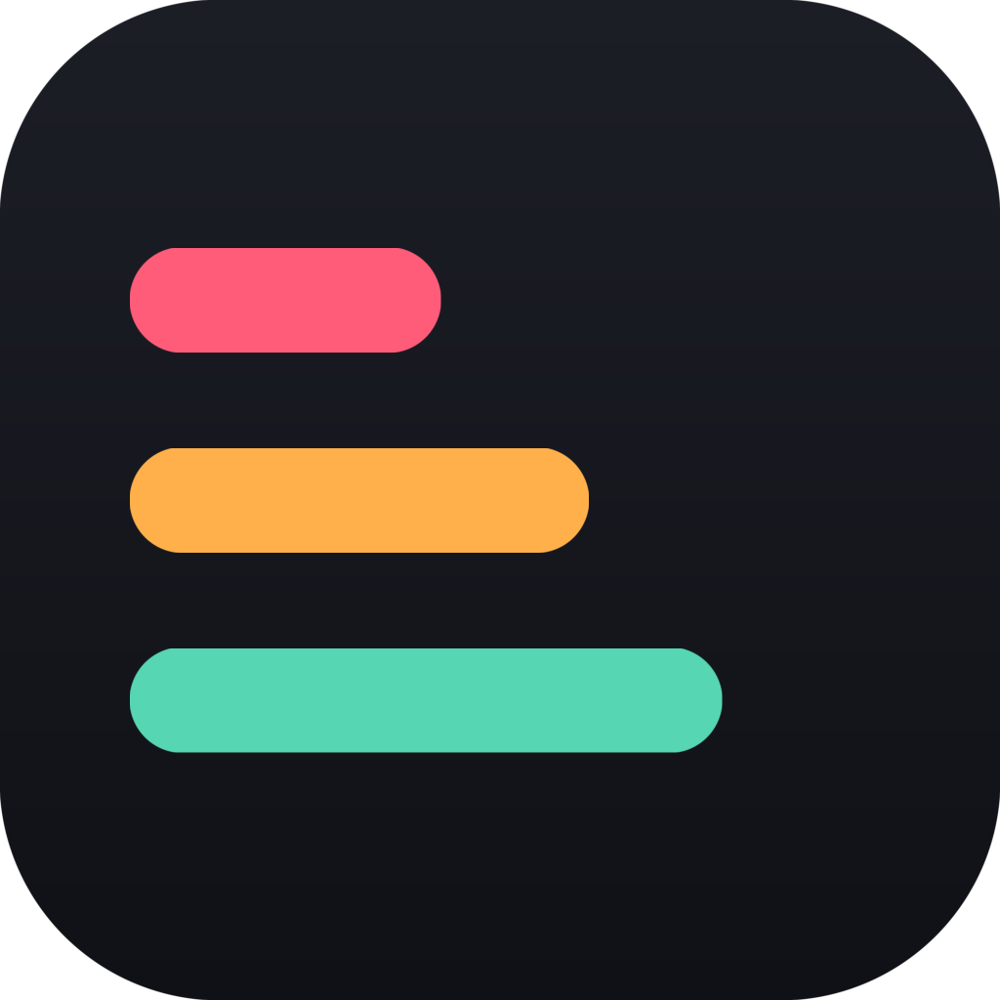

# Sortero

[](LICENSE)

A cross-platform desktop app for getting a DJ collection under control: one
canonical copy of every track, playlists that preserve your curation, clean
tags, and an intake lane for new music. Runs on macOS, Windows and Linux.



## The idea

The consensus among working DJs is that the *filesystem* should be shallow and
predictable, and the *software* should do the organising — crates and playlists
reference a track, they don't copy it. Sortero applies that:

- **One file per track**, at `Tracks/<Genre>/Artist - Title.ext`
- **Playlists as pointers.** Every folder you have today — Spotify/Tidal vibe
  imports, gig sets — becomes an `.m3u8` in `_Playlists/` pointing at that one
  file. A track curated into five vibes is five playlist entries and one file.
- **Key, BPM and energy live in tags**, where rekordbox and Mixxx can sort them.
- **Nothing is deleted.** Extra copies go to `_Quarantine/`. Every operation is
  journalled and reversible from the History tab.

## Layout it produces

```
DJ Collection/
  Tracks/<Genre>/Artist - Title.ext    canonical home for every track
  Sets/<Set Name>/                     optional: gig folders kept as folders
  Albums/<Album>/                      full releases, left intact
  Mixes/                               recordings over 20 minutes
  _Playlists/*.m3u8                    every folder you had, as a playlist
  _Quarantine/                         duplicates and rejects, never deleted
  To Be Processed/                     tracks waiting to be analysed
  Processed/                           analysed and ready to file
```

`To Be Processed` and `Processed` are never reorganised.

## Tabs

| Tab | What it does |
|---|---|
| **Overview** | Track count, size, and what share has key+BPM, genre and energy. Lists what needs attention. |
| **Organise** | Previews every move before anything happens. Collapses duplicates, writes playlists, files tracks by genre. |
| **Tags** | Strips download-site spam from Genre/Comment, infers missing Artist/Title from filenames, normalises Genre, and promotes Mixed In Key energy into the sortable Grouping field. |
| **Duplicates** | Exact (identical audio) and Likely (same artist/title/version, same length). Different remixes are never grouped. Extras move to `_Quarantine`. |
| **Import** | Add files or folders. Analysed tracks go straight to `Tracks/<Genre>`; anything missing key/BPM lands in `To Be Processed`. Tracks already in the library are flagged, not copied. **"Sort the 'Processed' folder"** files everything you've already run through PN and MIK. |
| **Needs Work** | Everything Sortero can't fix by itself, filtered by what's missing (key/BPM, energy, genre, artist, low bitrate). Select tracks and stage them in `To Be Processed` for whichever analysis tool you use. Your own set recordings are excluded. |
| **Playlists** | Rebuild a Spotify or TIDAL playlist against your local files, or rebuild the folder playlists. |
| **History** | Every operation, with one-click undo. |

## The analysis loop

Sortero works out genre, artist and title on its own, but not key, BPM or
energy — those come from an analysis tool. The **Needs Work** tab closes that
loop:

1. Filter by *Missing key or BPM* and select what you want.
2. **Stage selected in 'To Be Processed'.**
3. Run that folder through your analysis tool, saving the results into `Processed`.
4. **Import → "Sort the 'Processed' folder"** files them by genre automatically.

Sortero doesn't care which tool wrote the tags — only that key and BPM are there.
Any of these work:

| Tool | Notes |
|---|---|
| **rekordbox / Serato / Traktor** | Already analyse on import. Free, and you probably have one. |
| **[Mixxx](https://mixxx.org)** | Free and open source on every platform. Built-in key and BPM detection. |
| **[Mixed In Key](https://mixedinkey.com)** | Paid. Widely considered the most accurate for key, and the source of the 1–10 energy rating. |
| **KeyFinder** | Open source, key detection only. |

> **If you use Platinum Notes, run it *before* analysing.** It re-encodes the
> audio, so mastering afterwards leaves key and energy tags describing a file
> that no longer exists — silently, with no error. Platinum Notes is entirely
> optional; it improves audio quality and writes no tags Sortero needs. For the
> loudness part alone, [MP3Gain](https://alternativeto.net/software/mp3gain/) or
> your DJ software's auto-gain is a free substitute.

Staging a track out of a set or vibe folder does **not** cost you that
curation. Before anything moves, Sortero writes the folder out as a playlist
and records which playlists each staged track belonged to. When the track is
filed back out of `Processed`, it rejoins exactly those playlists at its new
location. Matching is on artist and title, so it survives Platinum Notes
renaming the file *and* changing its format — an MP3 that comes back as FLAC
still lands back in its set.

## Streaming playlists

Paste a Spotify or TIDAL playlist link on the **Playlists** tab and Sortero
matches each track against files you already own, then writes an `.m3u8`.

Connect an account (Playlists → Accounts) to read playlists of any length. It
uses OAuth 2.0 with PKCE: you sign in on Spotify's or TIDAL's own website, so
Sortero never sees your password, and the tokens are stored in your OS
credential store. One-time setup is creating a free app at
[developer.tidal.com](https://developer.tidal.com) or the
[Spotify dashboard](https://developer.spotify.com/dashboard) and adding
`http://127.0.0.1:8899/callback` as a redirect URI.

Without connecting, Spotify links fall back to a public preview capped at 50
tracks, and TIDAL links need a connection. Pasting a tracklist as
`Artist - Title` lines, or loading a CSV export, always works.

## Why energy ends up in Grouping

Mixed In Key writes `Cm - Energy 6` into the **comment** field. The key half
usually also reaches `TKEY`, but the energy half is stranded somewhere no DJ
software can sort on. Sortero copies it to **Grouping** as `5A - Energy 6`
(Camelot + energy), which rekordbox and Mixxx expose as a sortable column.

## First run

A setup wizard walks you through choosing your collection folder, reads it, and
explains the analysis loop. It appears once; after that Sortero opens straight
into your library. Reopen it any time from **Help → Setup Wizard…**.

**Help → Check for Updates…** compares your version against the latest GitHub
release and offers to open the download page. It can also check automatically
on launch (at most once a day) — toggle that in the same menu.

> While the repository is private, the update check can't read the release list
> anonymously and will say so. Either make the repo public, or add a GitHub
> token with `repo` scope to `settings.json` in the app data folder
> (**File → Open App Data Folder**).

## Running it

Build the app, then open `Sortero.app` and point it at your collection.

Sortero runs on **macOS, Windows and Linux**. Grab the build for your platform
from the [Releases page](../../releases):

| Platform | Artifact |
|---|---|
| macOS (Intel + Apple Silicon) | `Sortero-macOS-universal2.zip` |
| Windows | `Sortero-windows-x86_64.zip` |
| Linux | `Sortero-linux-x86_64.zip` |

### macOS: first launch

Builds are signed ad-hoc, not notarised — notarising requires a paid Apple
Developer account — so macOS blocks the first launch.

1. Drag `Sortero.app` wherever you want it; Applications is fine.
2. Open it once. macOS refuses, and the icon may bounce in the Dock without a
   window appearing.
3. **System Settings → Privacy & Security**, scroll to Security, click
   **Open Anyway** next to Sortero.
4. **Quit the bouncing icon if it's still there**, then open Sortero again.

Step 4 matters: the blocked launch leaves a stuck process behind, and while it's
running, opening the app again just brings that stuck copy to the front rather
than starting a working one. Only needed once per download.

**Windows** — SmartScreen may warn about an unknown publisher; More info → Run anyway.
**Linux** — needs Tk (`apt install python3-tk`).

### Building from source

```bash
python3.12 -m venv .venv
./.venv/bin/pip install -U pip mutagen keyring pyinstaller
./.venv/bin/python build/build_app.py
```

Requires Python 3.12 with Tk — `brew install python-tk@3.12` on macOS,
`apt install python3-tk` on Debian/Ubuntu; the Windows installer includes it.

A **universal2** macOS build needs a universal2 Python (the python.org
installer ships one; Homebrew's is single-architecture):

```bash
./.venv/bin/python build/build_app.py --universal2
```

The script checks the interpreter first and tells you if it can't. Release
builds run in GitHub Actions, where `setup-python` provides a universal2
interpreter — see `.github/workflows/release.yml`.

### Running without building

```bash
./.venv/bin/python run.py
```

## Testing mode

For a first big reorganisation, turn on **Testing → Start Testing Session**.
Everything you do from then on is recorded into a single restore point, saved
continuously as a `.bak` file, and a banner keeps count of what has changed.

- **Keep All Changes** — make it permanent and delete the backup. Individual
  operations stay in History and can still be undone one at a time.
- **Undo Everything in This Session** — put the collection back as it was.
- **Save Backup As… / Load Backup and Undo…** — the `.bak` is portable and
  self-contained, so it can undo the work from a different machine or after
  reinstalling.

The backup holds no audio, only the log: every move, and every tag change with
its previous value. That's enough to reverse everything, because none of these
operations ever delete a file.

Reverting restores the folder structure exactly and puts every tag value back.
Files whose tags were edited won't be byte-identical afterwards — rewriting an
ID3 tag rebuilds the tag container's padding and frame order. The audio streams
are bit-identical; verified with a decode-and-compare.

## Safety

- Dry-run previews on every destructive tab; nothing moves until you confirm.
- Journals live alongside your other app data: `~/Library/Application Support/Sortero`
  on macOS, `%APPDATA%\\Sortero` on Windows, `$XDG_DATA_HOME/sortero` on Linux.
- Duplicate removal is quarantine-only — Sortero never calls `unlink` on your music.
- Back up before the first big reorganisation anyway — or use Testing mode.

## License

GPL-3.0-or-later — see [LICENSE](LICENSE).

Sortero links [mutagen](https://mutagen.readthedocs.io/), which is GPL-2.0-or-later,
so distributed builds have to be GPL-compatible. keyring is MIT, and PyInstaller
is GPLv2 with a linking exception that does not constrain the bundled app.
