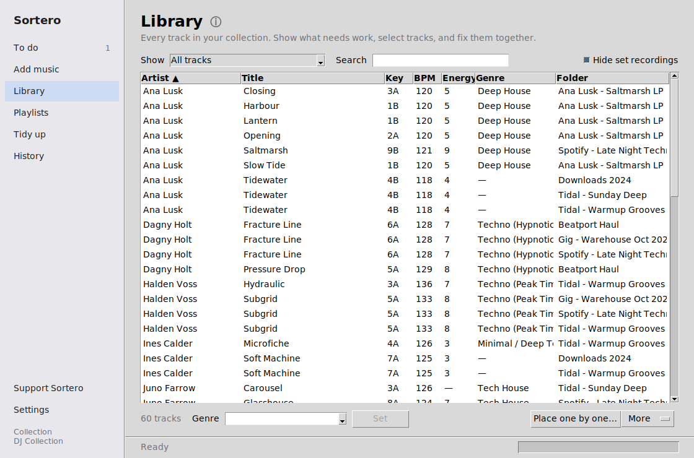
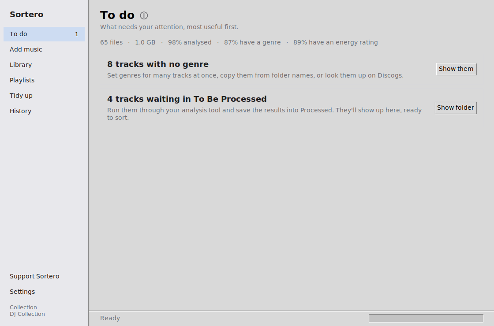
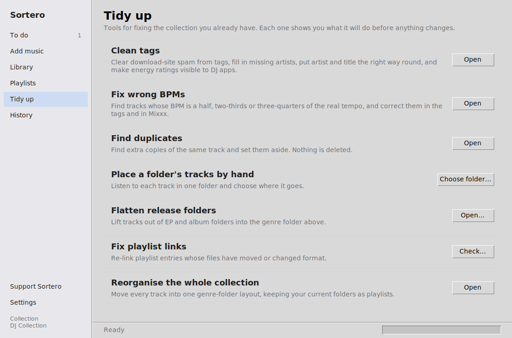
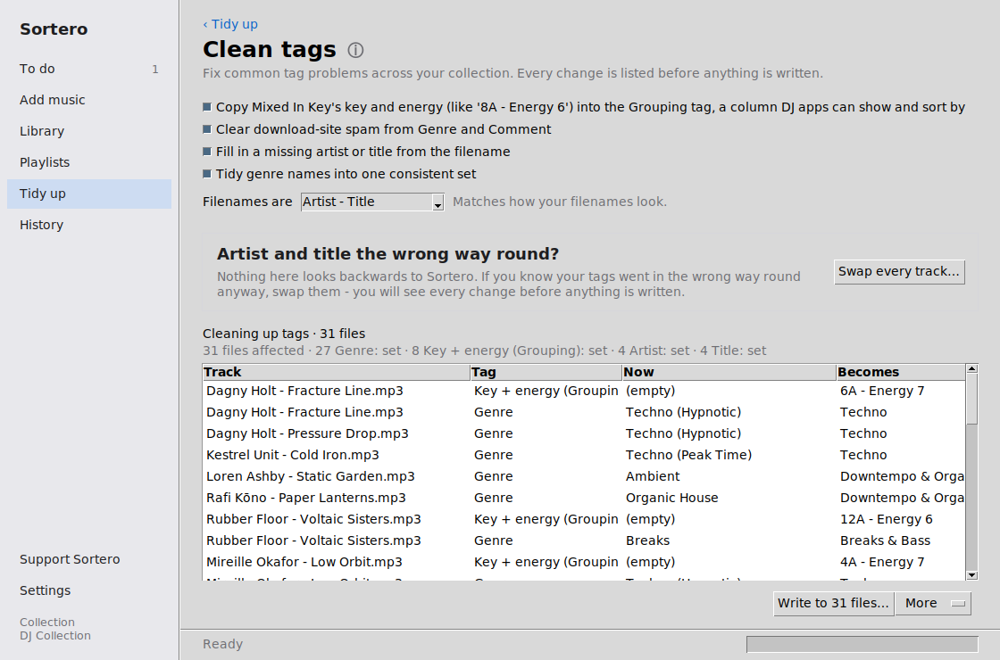
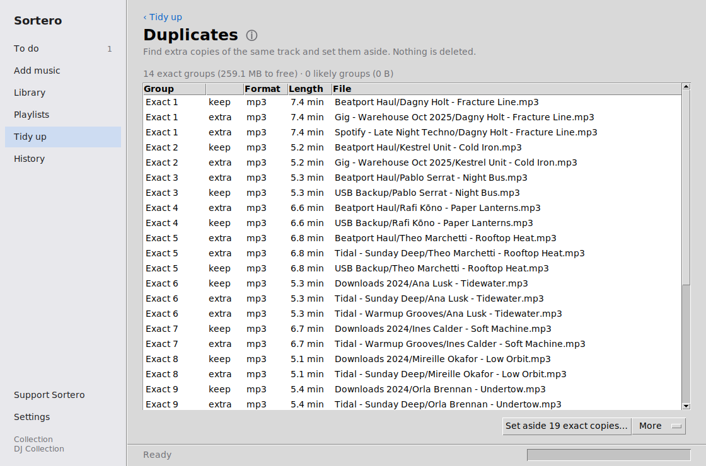
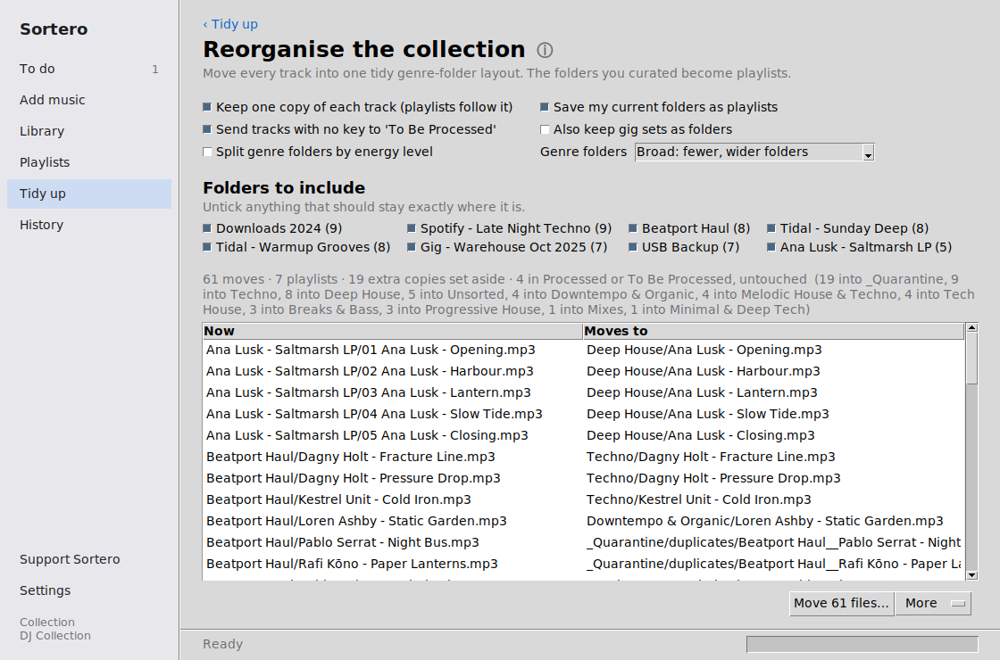

#  Sortero

[](LICENSE)

A cross-platform desktop app for getting a DJ collection under control: one
canonical copy of every track, playlists that preserve your curation, clean
tags, and an intake lane for new music. Runs on macOS, Windows and Linux.

> **Sortero is free and open source.** If it's been useful to you, please
> consider [buying a Supporter licence](#supporting-sortero). Sortero is an
> independent project: I pay to build and release it, with the help of Claude
> Code, and supporters are what keep it improving.

### ⬇️ [Try Sortero free (v0.18.0)](https://github.com/sparkly-quasar/sortero/releases/tag/v0.18.0) · [How to install](#install--update)

Ready-to-run for macOS, Windows and Linux. The app isn't code-signed, so your
computer warns you once on first launch; [the install steps](#install--update)
show you how to get past it.



## The idea

The consensus among working DJs is that the *filesystem* should be shallow and
predictable, and the *software* should do the organising — crates and playlists
reference a track, they don't copy it. Sortero applies that:

- **One file per track**, at `<Genre>/Artist - Title.ext`, straight inside the
  collection folder
- **Playlists as pointers.** Every folder you have today — Spotify/Tidal vibe
  imports, gig sets — becomes an `.m3u8` in `_Playlists/` pointing at that one
  file. A track curated into five vibes is five playlist entries and one file.
- **Key, BPM and energy live in tags**, where rekordbox and Mixxx can sort them.
- **Nothing is deleted.** Extra copies go to `_Quarantine/`. Every operation is
  journalled and reversible from History.

## Screenshots

Taken on Linux with a sample collection of made-up artists.

**To do** lists what needs your attention, most useful first.



**Library** shows every track with its key, BPM, energy and genre.


**Tidy up** gathers the tools for fixing the collection you already have.



**Clean tags** lists every change before anything is written.



**Duplicates** finds extra copies and picks one to keep.



**Reorganise** previews the move into one genre-folder layout, keeping your
folders as playlists.



## Layout it produces

```
DJ Collection/
  <Genre>/Artist - Title.ext           canonical home for every track
  Sets/<Set Name>/                     optional: gig folders kept as folders
  Albums/<Album>/                      full releases, left intact
  Mixes/                               recordings over 20 minutes
  _Playlists/*.m3u8                    every folder you had, as a playlist
  _Quarantine/                         duplicates and rejects, never deleted
  To Be Processed/                     tracks waiting to be analysed
  Processed/                           analysed and ready to file
```

`To Be Processed` and `Processed` are never reorganised.

**Genre detail** is a choice in **Tidy up → Reorganise the whole collection**. *Broad* gives a handful of wide
folders; *fine* keeps subgenres apart — `Techno (Peak Time)` separate from
`Techno (Hypnotic)`, `Deep House` from `Tech House`. Either way the layout stays
one flat level. Labels Sortero picked always get their own folder; a raw tag
value that matched no rule needs at least 8 tracks to earn one, so oddities like
`Mainstage` don't litter the tree.

**Split by energy** is an optional tick in the same place. When on, each genre
folder gains `Energy 1`…`Energy 10` subfolders, filed from the Mixed In Key
rating (`Techno/Energy 6/…`). Tracks with no rating — your own rips and
recordings — stay directly in the genre folder rather than in a catch-all.

## Finding your way around

A sidebar on the left, one job per screen. Each screen has a one-line summary
under its title, and an **ⓘ** beside the title for the longer explanation. The
main action is always the blue button at the bottom right, with **More** beside
it for the rest.

What **More** holds is the rest, though, not the point. If a screen has counted
something for you — tracks whose tags look backwards, duplicate copies waiting,
new music held back for you to place — the way to act on it sits next to the
button, with the number in it, rather than behind a menu you had no reason to
open.

| Screen | What it's for |
|---|---|
| **To do** | Home. Cards for the jobs worth doing, most useful first, each with one button: analysed tracks waiting in `Processed`, tracks in `Unsorted`, tracks with no genre, tracks not analysed yet, tracks whose artist and title are the wrong way round, tags full of download-site spam. The number beside it in the sidebar is how many jobs there are. |
| **Add music** | Choose a folder or files. Analysed tracks go to the folder that already means their genre — yours if you have one. Anything missing a key lands in `To Be Processed`. Tracks with no genre to go on are **held back for you to place** instead of being dropped in `Unsorted`. Tracks already in the library are pointed out, not added twice. |
| **Library** | Every track in one list. **Show** filters to what needs work (no genre, not analysed, no energy, no artist, artist and title swapped, no BPM, low bitrate); **Search** narrows it; click a column heading to sort. Select tracks and set a genre, swap artist and title, re-read both from the filename, send them to analysis, place them one by one, copy genres from folder names, or look them up on Discogs. Your own set recordings are hidden unless you ask. |
| **Playlists** | Rebuild a Spotify or TIDAL playlist against your local files from a link, a pasted tracklist or a CSV — all three offered together above the list. **More** rebuilds the folder playlists or repairs broken links. |
| **Tidy up** | Tools for an existing collection: **Clean tags** (including which way round filenames read), **Fix wrong BPMs**, **Find duplicates**, **Place a folder's tracks by hand**, **Flatten release folders**, **Fix playlist links**, and **Reorganise the whole collection**. Every tool previews before it changes anything. |
| **History** | Every operation, with undo, and the **safety net**. **Show log** reveals the detailed log. |
| **Settings** | Collection folder, update checks, Discogs token, Spotify and TIDAL accounts, and the setup guide. |

`Cmd-1`…`Cmd-6` (`Ctrl` on Windows and Linux) jump between screens, `Cmd-,`
opens Settings and `Cmd-R` reads the collection again. Sortero follows your
system's light or dark appearance.

## The analysis loop

Sortero works out genre, artist and title on its own, but not key, BPM or
energy — those come from an analysis tool. Sortero closes that loop:

1. **To do → "tracks not analysed yet" → Show them**, or **Library → Show: Not
   analysed yet**. Select what you want.
2. **Send to analysis…** moves them into `To Be Processed`.
3. Run that folder through your analysis tool, saving the results into `Processed`.
4. **To do → Sort them…** files them by genre. That card appears whenever
   `Processed` has tracks waiting, and the setup guide files them as its first
   real step, so the loop closes even if you walk away mid-way.

Staged tracks remember the genre they came from. Analysis tools routinely strip
the genre tag when they re-encode, and without that memory every returning track
would land in `Unsorted` — on a real batch, 251 of 262.

Sortero doesn't care which tool wrote the tags — only that key and BPM are there.
Any of these work:

| Tool | Notes |
|---|---|
| **rekordbox / Serato / Traktor** | Already analyse on import. Free, and you probably have one. |
| **[Mixxx](https://mixxx.org)** | Free and open source on every platform. Built-in key and BPM detection. |
| **[Mixed In Key](https://mixedinkey.com)** | Paid. Widely considered the most accurate for key, and the source of the 1–10 energy rating. |
| **KeyFinder** | Open source, key detection only. |

> **If you use Platinum Notes, run it *before* analysing.** It re-encodes the
> audio, so mastering afterwards leaves key and energy tags describing a file
> that no longer exists — silently, with no error. Platinum Notes is entirely
> optional; it improves audio quality and writes no tags Sortero needs. For the
> loudness part alone, [MP3Gain](https://alternativeto.net/software/mp3gain/) or
> your DJ software's auto-gain is a free substitute.

Staging a track out of a set or vibe folder does **not** cost you that
curation. Before anything moves, Sortero writes the folder out as a playlist
and records which playlists each staged track belonged to. When the track is
filed back out of `Processed`, it rejoins exactly those playlists at its new
location. Matching is on artist and title, so it survives Platinum Notes
renaming the file *and* changing its format — an MP3 that comes back as FLAC
still lands back in its set.

Filing a track into its genre folder also **writes that genre into the file**.
Without it the folder knew the genre and the tag didn't, so rekordbox, Mixxx and
Sortero's own Library all still saw the track as untagged. An existing genre
tag is never overwritten.

## Artist - Title, or Title - Artist?

Sortero reads a filename like `Deadmau5 - Strobe.wav` as artist first. Plenty of
collections are the other way round, and reading those backwards puts the title
in the artist tag, files the track as `Strobe - Deadmau5.wav`, and sends the
wrong words to Discogs.

**Tidy up → Clean tags → Filenames are** settles it: `Artist - Title` or
`Title - Artist`. Everything that reads a name off a filename then follows it —
filling in missing tags, adding new music, repairing playlist links.

Sortero also works out which way your collection reads and says so next to that
choice. Nothing about one filename can tell it — `Strobe - Deadmau5` and
`Deadmau5 - Strobe` are the same two words — but a collection is not one
filename. Two kinds of evidence, strongest first:

- **What your tags already know.** If the right-hand half of a filename is an
  artist that *another* file's tags name, and the left-hand half is nobody,
  that file reads title-first. No file votes on the strength of its own tags,
  so a wrong assumption can't confirm itself, and a name whose halves are both
  known artists doesn't vote at all.
- **What comes back.** With no tags to go on — or every one of them backwards —
  the names still carry it: an artist recurs across a collection and a title
  recurs once. Mix and version wording is stripped before counting, because
  `Strobe - Extended Mix` looks exactly like an `A - B` name and isn't, and a
  side must carry at least three *different* recurring names to count, so one
  token repeating 13 times (a label, a bootleg tag) proves nothing.

Either way it takes at least 8 files and a clear majority before Sortero says
anything, and the note tells you which evidence it used, because a guess from
names alone is worth less than one your tags confirm. It only ever suggests:
the setting is yours, and a collection where nothing recurs gets no opinion.

For tags that are already in backwards, **Clean tags** carries a panel of its
own, headed *Artist and title the wrong way round*. It counts the tracks whose
tags look swapped and leads with whichever fix suits that count:

- **A few of them** — it offers *Show the 14 tracks*, which opens the Library
  filtered to exactly those, where you pick the ones you mean and swap those.
  Swapping everything is still there, as the quieter second option.
- **Most of them** — it offers *Swap every track…* first, because at that point
  the whole collection is the problem, and says how many of how many it can
  vouch for.

The filter behind that count cross-references real tags, so a file with no
metadata never appears in it and never needs to: nothing wrong is written to it
yet, and the order setting above handles it from here.

Whichever job you run, the screen names it — on the line above the list, on the
button, and in the question before anything is written, which also shows a few
of your own tracks as they will read afterwards:

```
Swap artist and title on 1,842 files?

  Kaskade - Atmosphere      becomes      Atmosphere - Kaskade
  Strobe - Deadmau5         becomes      Deadmau5 - Strobe
  …and 1,839 more.

1,804 of them look backwards to Sortero, so this fits.

You can undo this from History, and swapping twice puts it back.
```

That last line is not reassurance, it is arithmetic: the swap exchanges two
strings and nothing else, so running it twice returns the collection exactly
where it started. When the evidence *disagrees* — you ask to swap everything
and only three tracks look backwards — the same sentence says so instead.

**More** keeps **Read artist and title from the filenames again**, for when the
filenames are right and the tags are a mess.

A track with no artist or title tag at all is never swapped: there is nothing
written to put the wrong way round, and the name Sortero read off the filename
is already being read the way you asked.

## When there's no genre to infer

Sortero derives genre from tags and folder names. When a file has neither —
an analysis tool stripped the tag, or a Bandcamp rip never had one — there is
nothing to infer from, and it lands in `Unsorted`. **Library → Show: Needs a
genre** is the way out: select a group and set it, or **More → Look up selected
on Discogs**.

Discogs needs no API token. Its free tier is rate limited, so lookups are paced
at 2.5s and cached on disk — re-running never asks twice. A free personal token
from discogs.com/settings/developer raises the rate to about one per second;
paste it into **Settings** if you're doing a big batch.

A long run reports as it goes: results fill the *Discogs suggests* column while it works,
the status line shows how many are done and roughly how long is left, and Stop
keeps everything already fetched. The cache is written throughout, so a stopped
or crashed run resumes where it left off rather than starting over. Queries are cleaned
first (`Track (Original Mix)_PN` → `Track`), which took the hit rate from 1-in-8
to 6-in-10 on a real batch. Only artist and title are sent.

Coverage is honest, not magic: well-known club tracks resolve, obscure Bandcamp
material often doesn't. For that tail, set it by hand — that's what bulk
assignment is for.

## Placing tracks by hand

Some tracks have nothing to infer a genre from — the analysis tool stripped the
tag, the rip never had one, Discogs doesn't know it. Sortero no longer quietly
files those into `Unsorted`. Add music **holds them back**, and the one-by-one
window (**Place held-back tracks…**, **Place one by one…** in Library, or
**Place them…** on the To do card) walks through them one at a time:

- every hint on screen: the genre tag, key and energy, the playlist it was
  staged out of, and Discogs styles if they've been looked up
- **Play** with a **scrub bar**: drag anywhere in the track, or jump ±15s
  past a long intro; space plays and pauses. AAC files (`.m4a`) can't be
  scrubbed and play from the start instead
- your collection's **real folders** to pick from — type to filter, or type a new
  name to create one
- your last nine choices on the number keys, and **Return** to file and move on

**Place a folder's tracks by hand** (Tidy up, or the File menu) does the same for a whole
folder already in your collection — say a Spotify or Tidal vibe playlist you
want spread across genre folders. It offers to save the folder as a playlist
first, which then follows each track as it's filed, so the set stays together
even once the folder is empty. Tracks come up in the folder's own order, the
folder itself isn't offered as a destination, and **Skip** leaves a track
where it is.

Choices are saved as you go, so closing half way loses nothing. Nothing moves
until you say so. Each track takes its folder's name as its genre, rejoins any
playlists it came from, and every playlist entry pointing at its old location
follows it. All of it is one undoable step in History.

## Sorting the Processed folder

**Sort them…** on the To do card, **Add music → Already analysed? Sort the
Processed folder…**, or **File → Sort the Processed Folder…** opens one window that deals with everything in `Processed`, in three groups:

- **Ready to file** — shows where each will go; one button files them. Anything
  still missing a key goes back to `To Be Processed`.
- **Choose a folder by hand** — no genre to go on; opens the one-by-one window.
- **Already in your library** — fresh copies of tracks you already have. Platinum
  Notes writes a new file and leaves the original, so the analysed version looks
  like a duplicate of its own original; before this, those were refused and sat
  in `Processed` forever. For each, choose **Replace library copy** (the new copy
  takes the old one's place, playlists follow, the old copy goes to `_Quarantine`),
  **Keep library copy** (the new one is set aside), or **Keep both**.

Sensible defaults are pre-chosen: identical audio keeps the library copy, a length
difference of more than three seconds keeps both (it may be another edit), and
otherwise the version you just processed replaces the old one. Tags the old copy
had and the new one lacks — genre, album, energy — carry over. Nothing is deleted,
and each group's action is its own undoable step.

## Your layout, not Sortero's

Sortero files genres at the top of the collection, which is how most people do
it by hand anyway, and a library already organised as `House/`,
`Techno/Hypnotic Techno/` is simply carried on rather than replaced. Intake
files a Tech House track into your existing `Tech House` folder, and a genre
that has no folder yet is created alongside yours.

A genre folder shares the top level with `Sets/`, `Albums/`, `Mixes/`,
`_Playlists/`, `_Quarantine/` and the two staging folders, so a genre that
would collide with one of those — a tag literally reading `Mixes` — is filed as
`Mixes (genre)` instead. Otherwise its tracks would be taken for recordings and
left alone forever.

Collections Sortero filed under `Tracks/<Genre>` before this are left where
they are, not split across two layouts. The next **Reorganise** moves them up
and removes the empty `Tracks/`; you see every move in the preview first, and
History undoes the lot. Folders are matched by name, so `Lez Dance` or `smooth vibes` — curation,
not genres — never swallow tracks just because they share a word with one.
The energy split's `Energy N` subfolders are part of the layout too: never
flattened away, and never mistaken for a genre.

## Flattening release folders

A hand-built library drifts into `Genre/Subgenre/Some EP/track`, and for DJing
the release folder is one more click. **Tidy up → Flatten release folders**
lists every folder holding tracks below its genre folder, and lifts the ones you
tick into that genre folder, removing the emptied release folder.

Folders of 60 tracks or fewer — a release — are ticked for you. Bigger ones,
like a whole label's archive or a Beatport top 100 dump, are listed but left
unticked. Filenames are kept; a clash gets a number rather than overwriting. The
release name can be kept in the Album tag, playlists follow the moved files, and
undo puts the release folders back exactly.

## Fixing wrong BPMs

Beat detection often locks on to the wrong pulse. Rolling percussion in
hypnotic techno makes a 140 track read as 93.33 (two-thirds), and a sparse one
reads as 70 (half). The number is precise, just scaled, so DJ software shows
it confidently and sync is useless.

**Tidy up → Fix wrong BPMs** checks the whole collection or one folder you
choose (remembered for next time). It looks only at tracks whose BPM is unusual for
their genre (a techno track at 93), listens to a minute of each, and suggests
a fix only when the audio's strongest tempo sits right on a whole multiple of
the current value: x2, x3/2 or x4/3, or the inverse. For x3/2 and x4/3 the
audio must also clearly prefer the new tempo, since a slow track with triplet
hats pulses at both. Genres without a typical tempo (downtempo, breaks,
hip-hop, disco) are never touched, and anything that isn't clear-cut is left
alone.

Before fixing anything you can listen: select a row and it plays from the
part of the track Sortero checked, with a scrub bar and ±15s. Tap along to
the kick (**Tap**, or **T**) and Sortero says whether your tempo matches the
fix or the current BPM. Tapping every other kick counts too. Leave out any
track that doesn't sound right. **Fix this track** corrects the selected one
and moves to the next; **More → Switch to fixing all tracks at once** turns the
button into one that fixes the whole list.

Mixxx keeps its own BPM and beatgrid and ignores the file's tag once it has
analysed a track, so fixing the tag alone changes nothing there. If Sortero
finds Mixxx's library it corrects that too, **while Mixxx is closed**. It
backs the library up first, moves the grid's first beat onto a kick where
needed, and locks the corrected BPM so a re-analysis doesn't bring back the
wrong one. Tags and Mixxx changes both undo from History.

## Streaming playlists

Paste a Spotify or TIDAL playlist link on the **Playlists** screen and Sortero
matches each track against files you already own, then writes an `.m3u8`.

Connect an account (**Settings → Spotify and TIDAL**) to read playlists of any length. It
uses OAuth 2.0 with PKCE: you sign in on Spotify's or TIDAL's own website, so
Sortero never sees your password, and the tokens are stored in your OS
credential store. One-time setup is creating a free app at
[developer.tidal.com](https://developer.tidal.com) or the
[Spotify dashboard](https://developer.spotify.com/dashboard) and adding
`http://127.0.0.1:8899/callback` as a redirect URI.

Without connecting, Spotify links fall back to a public preview capped at 50
tracks, and TIDAL links need a connection. Pasting a tracklist as
`Artist - Title` lines, or loading a CSV export, always works.

## Why energy ends up in Grouping

Mixed In Key writes `Cm - Energy 6` into the **comment** field. The key half
usually also reaches `TKEY`, but the energy half is stranded somewhere no DJ
software can sort on. Sortero copies it to **Grouping** as `5A - Energy 6`
(Camelot + energy), which rekordbox and Mixxx expose as a sortable column.

## First run

A setup guide walks you through choosing your collection folder, reads it, and
explains the analysis loop. It appears once; after that Sortero opens straight
onto To do. Reopen it any time from **Help → Setup Guide…** or Settings.

**Help → Check for Updates…** compares your version against the latest GitHub
release. If there's a newer one, a supporter's copy offers to **download,
install and relaunch** in one step: Sortero fetches the build for your platform, hands the swap to a
small helper, quits, and reopens on the new version.

The helper waits for Sortero to exit before touching anything, keeps the old
copy aside until the new one is in place, and puts it back if the move fails —
a failed update never leaves you without an application.

Two caveats. Running from source it won't self-update, and points you at the
new code instead; a built copy without a licence says where to get a Supporter
licence. And macOS asks permission before one app modifies another in `/Applications`; if it's
refused, allow Sortero under **System Settings → Privacy & Security → App
Management**, or keep Sortero somewhere in your home folder.

It can also check automatically on launch (at most once a day) — toggle that in
Settings.
## Install & update

There are three ways to run Sortero. All of them have every feature.

- **Try it free:** download the ready-to-run app from
  **[v0.18.0](https://github.com/sparkly-quasar/sortero/releases/tag/v0.18.0)**,
  the last release with public downloads. It's a few versions behind, but it's
  the quickest way to see whether Sortero suits you.
- **Supporter licence:** the latest app for macOS, Windows and Linux, with
  one-click updates. See [Supporting Sortero](#supporting-sortero).
- **From source, free and always current:** see
  [Building from source](#building-from-source).

On the release page, open **Assets** and download the zip for your computer:

| Your computer | Download |
| --- | --- |
| Mac (Apple Silicon or Intel) | `Sortero-macOS-universal2.zip` |
| Windows (64-bit) | `Sortero-windows-x86_64.zip` |
| Linux (64-bit) | `Sortero-linux-x86_64.zip` |

The app isn't code-signed, so your computer warns you once on first launch.
The steps below get you past it.

### macOS (Apple Silicon and Intel)

1. Download **`Sortero-macOS-universal2.zip`** and double-click it to unzip.
2. Drag **Sortero.app** into **Applications**, or anywhere in your home folder.
3. Open Sortero. macOS refuses because the app isn't notarised: click **Done**.
   The icon may bounce in the Dock without a window appearing.
4. **If the icon is still in the Dock, quit it** (right-click → Quit, or
   Force Quit from the Apple menu).
5. Go to **System Settings → Privacy & Security**, scroll down to Security, and
   click **Open Anyway** next to *"Sortero" was blocked*.
6. Open Sortero again and click **Open**. You only do this once per download.

Step 4 matters: the blocked launch leaves a stuck process behind. While it's
running, opening Sortero again just brings that stuck copy to the front instead
of starting a working one.

On macOS 15 Sequoia and later, right-click → Open no longer gets past the
block, so use step 5. In Terminal, this does the same thing:

```bash
xattr -dr com.apple.quarantine /Applications/Sortero.app
```

### Windows

1. Download **`Sortero-windows-x86_64.zip`**.
2. Right-click it → **Extract All…**, and pick a folder to keep it in, such as
   `Documents` or `C:\Program Files`. Run Sortero from the extracted folder,
   not from inside the zip.
3. Open the **Sortero** folder and double-click **`Sortero.exe`**.
4. Windows shows **"Windows protected your PC"**: click **More info**, then
   **Run anyway**. You only do this once.
5. To find it again easily, right-click `Sortero.exe` → **Pin to Start**, or
   **Send to → Desktop (create shortcut)**.

Keep `Sortero.exe` inside its folder. It needs the files next to it.

### Linux

1. Download **`Sortero-linux-x86_64.zip`** and unzip it:

   ```bash
   unzip Sortero-linux-x86_64.zip -d ~/Applications
   ```

2. Run it:

   ```bash
   ~/Applications/Sortero/Sortero
   ```

If it doesn't start, install Tk (`sudo apt install python3-tk` on
Debian/Ubuntu, `sudo dnf install python3-tkinter` on Fedora) and try again.

### Updating

**Help → Check for Updates…** compares your copy with the latest release. With a
Supporter licence, Sortero downloads, installs and relaunches the new version in
one step. Without one, it tells you where to get one, or you can
[build the latest from source](#building-from-source). Details are under
[First run](#first-run).

**Your collection and history are safe either way.** Sortero never stores
anything inside the app. Your music stays in your collection folder, and the
journals that make every change reversible live in your app-data folder
(`~/Library/Application Support/Sortero` on macOS, `%APPDATA%\Sortero` on
Windows, `$XDG_DATA_HOME/sortero` on Linux). Replacing or deleting the app
never touches them.

### Building from source

```bash
python3.12 -m venv .venv
./.venv/bin/pip install -U pip mutagen keyring certifi pygame-ce pyinstaller
./.venv/bin/python build/build_app.py
```

Requires Python 3.12 with Tk — `brew install python-tk@3.12` on macOS,
`apt install python3-tk` on Debian/Ubuntu; the Windows installer includes it.

A **universal2** macOS build needs a universal2 Python (the python.org
installer ships one; Homebrew's is single-architecture):

```bash
./.venv/bin/python build/build_app.py --universal2
```

The script checks the interpreter first and tells you if it can't. Release
builds run in GitHub Actions, where `setup-python` provides a universal2
interpreter — see `.github/workflows/release.yml`.

### Running without building

```bash
./.venv/bin/python run.py
```

## Safety net

For a first big reorganisation, turn on the safety net (**History → Turn on…**,
or **Safety Net → Turn On Safety Net…**). Everything you do from then on is
recorded into a single restore point, saved continuously as a `.bak` file, and
an orange banner keeps count of what has changed.

- **Keep changes** — make it permanent and delete the backup. Individual
  operations stay in History and can still be undone one at a time.
- **Undo everything** — put the collection back as it was.
- **Save Backup As… / Load a Backup and Undo It…** — the `.bak` is portable and
  self-contained, so it can undo the work from a different machine or after
  reinstalling.

The backup holds no audio, only the log: every move, and every tag change with
its previous value. That's enough to reverse everything, because none of these
operations ever delete a file.

Reverting restores the folder structure exactly and puts every tag value back.
Files whose tags were edited won't be byte-identical afterwards — rewriting an
ID3 tag rebuilds the tag container's padding and frame order. The audio streams
are bit-identical; verified with a decode-and-compare.

## Supporting Sortero

Sortero is free and open source. Every feature is free for everyone, and anyone
can build it from this repository. If Sortero is useful to you, please buy a
**Supporter licence** to fund ongoing fixes and improvements.

It's a single payment and you choose the amount. There's no subscription. As a
thank-you, supporters get the ready-to-run app for macOS, Windows and Linux, and
one-click updates for good.

Buy it from **Support Sortero** in the app, through Stripe. After paying you land
on a page with your licence key and download buttons. Paste the key into Sortero
to turn on updates.

Selling it is set up in [`server/README.md`](server/README.md). Free keys for
yourself or anyone you like come from `tools/licence_admin.py gift`.

## Safety

- Previews before every change; nothing moves until you confirm.
- Journals live alongside your other app data: `~/Library/Application Support/Sortero`
  on macOS, `%APPDATA%\\Sortero` on Windows, `$XDG_DATA_HOME/sortero` on Linux.
- Duplicate removal is quarantine-only — Sortero never calls `unlink` on your music.
- Back up before the first big reorganisation anyway — or use the safety net.

## License

GPL-3.0-or-later — see [LICENSE](LICENSE).

Sortero links [mutagen](https://mutagen.readthedocs.io/), which is GPL-2.0-or-later,
so distributed builds have to be GPL-compatible. keyring is MIT, and PyInstaller
is GPLv2 with a linking exception that does not constrain the bundled app.
